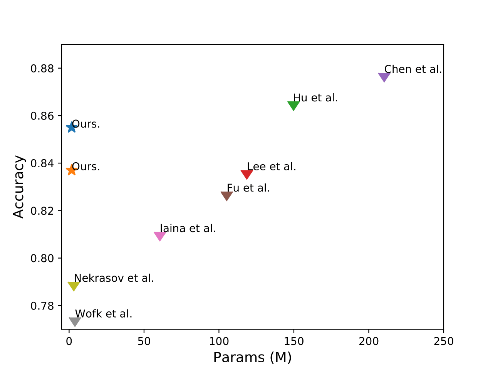
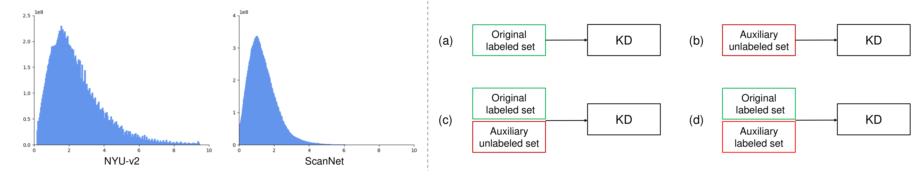
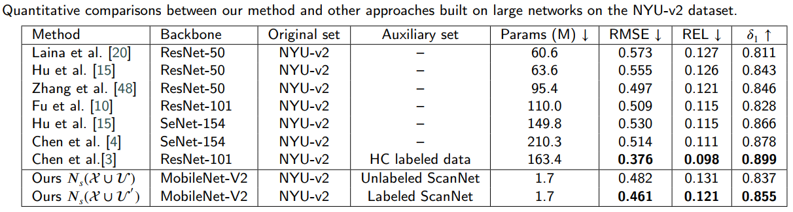

# Light-Weight Depth Estimation
<br>
Boosting Light-Weight Depth Estimation Via Knowledge Distillation, https://arxiv.org/abs/2105.06143 <br>

Junjie Hu, Chenyou Fan, Hualie Jiang, Xiyue Guo, Yuan Gao, Xiangyong Lu, Tin Lun Lam 

Introduction
-
This repo provides trained models and evaluation code for the light weight model for depth estimation. 

<p align="left">
 
</p>

We aim to enable depth estimation to be both computationally efficient and accurate.
We developed a knowledge distillation method with auxiliary unlabeled/labeled data for this purpose.  
<p align="center">
	
</p>

We found that:
+  Even without access to the original training set, we can still successfully apply KD with enough auxiliary unlabeled samples as long as they have similar scene scales to the original training samples. 
  
+  When applying KD with the original trained set and auxiliary unlabeled set together, the performance improvement is significant as the gap between the teacher and student is better filled.
 
+  The improvement of the light-weight network is limited if we directly train it with the mixed dataset of both original and auxiliary labeled data due to its low capacity. On the other hand, the two-stage learning strategy, i.e. training a larger teacher and then apply KD is more effective.

Results
-
<p align="center">
	
</p>

Dependencies
-
+ python 3.6<br>
+ pytorch 1.7.1<br>


Download
-
+ Download the NYU-v2 dataset: [NYU-v2 dataset](https://drive.google.com/file/d/1WoOZOBpOWfmwe7bknWS5PMUCLBPFKTOw/view?usp=sharing) <br>
+ Download the trained networks for depth estimation: [Depth estimation networks](https://drive.google.com/file/d/1yr5S5FIheL1mUfBzVJ8KqcIq9JP-jd4z/view?usp=sharing) <br>

Evaluation
-
Get results on the NYU-v2 test set by simply running test.py 							  
+ python test.py<br>

Citation
-
```
  @article{hu2021boosting,
      title={Boosting Light-Weight Depth Estimation Via Knowledge Distillation},
      author={Hu, Junjie and Fan, Chenyou and Jiang, Hualie and Guo, Xiyue and Gao, Yuan and Lu, Xiangyong and Lam, Tin Lun},
      journal={arXiv preprint arXiv:2105.06143},
      year={2021}
  }
 ``` 
